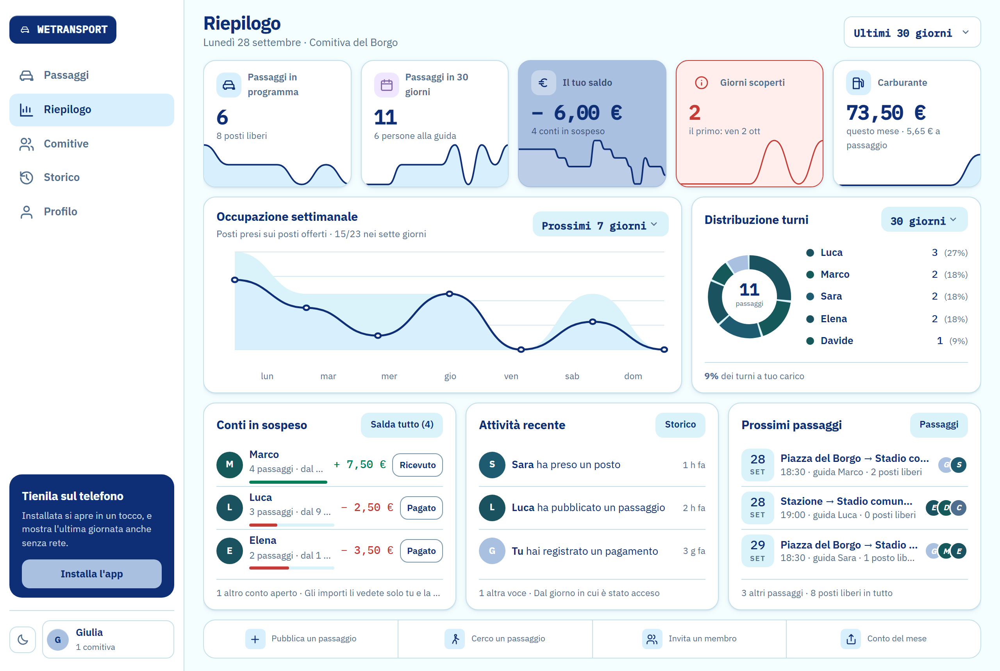
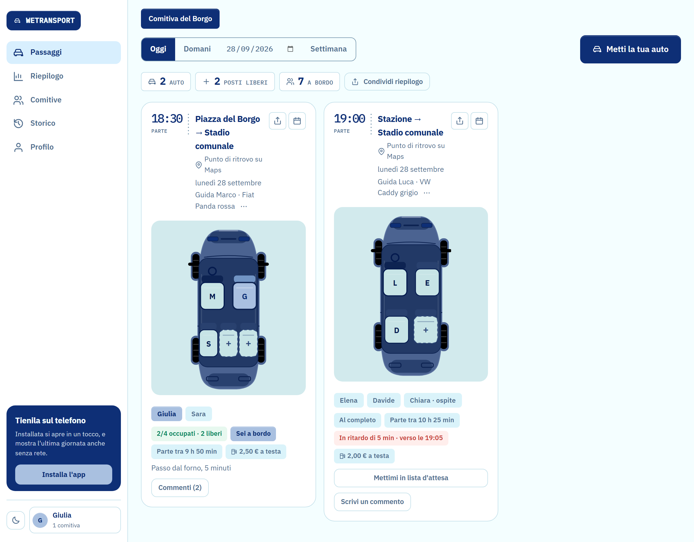
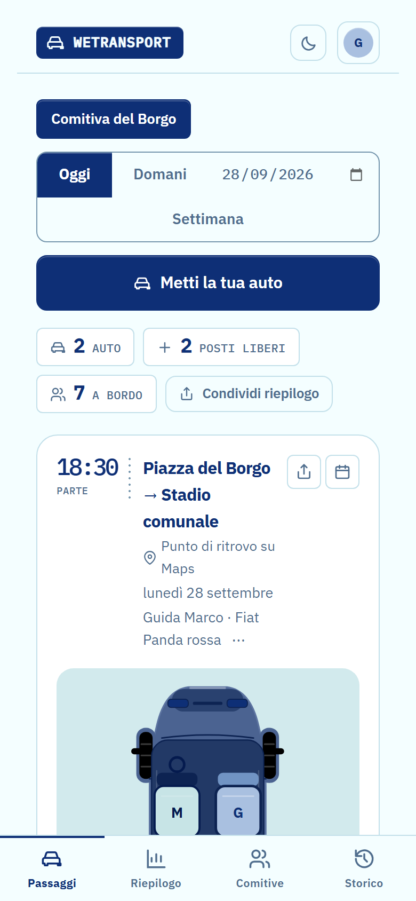
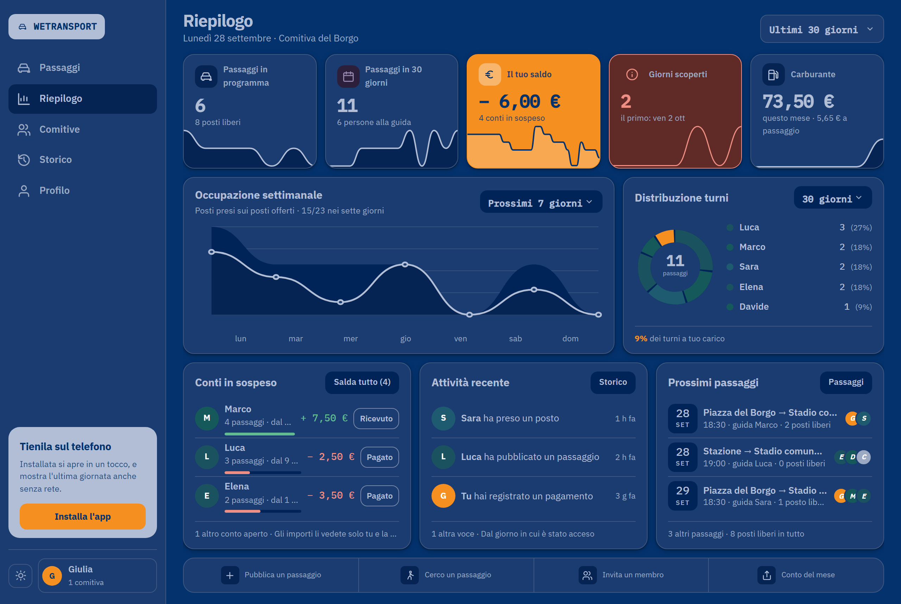

# WeTransport

**Chi guida oggi, e c'è posto per me?** Una web app installabile per organizzare i passaggi in
auto di una comitiva: chi guida pubblica la sua macchina, gli altri prenotano un sedile preciso
toccandolo sul disegno dell'auto, e la benzina si divide e si salda senza fare conti a mano.

Sito: <https://wetransport.netlify.app> · Sviluppata dal 18/07 al 28/09/2026 · **Progetto chiuso**
(il perché è [più sotto](#perché-si-è-fermato)).

> **In English, briefly.** WeTransport is a carpooling PWA for groups of friends: drivers publish
> their car, passengers book a specific seat on an SVG drawing of it, and fuel costs are split and
> settled in-app. Vanilla JS with no build step, Supabase (Postgres + Row Level Security), Netlify.
> Code, comments and docs are in Italian.



| La giornata: le auto e i sedili | Sul telefono | Il tema scuro |
|---|---|---|
|  |  |  |

<sub>Dati inventati. Le immagini sono del codice vero, con Supabase simulato nel browser.</sub>

## Cosa fa

- **Il sedile, non il "posto".** Ogni auto è un SVG disegnato a misura: si tocca il sedile libero
  e si è a bordo. Libero, occupato e tuo si distinguono anche per forma ed etichetta, non solo
  per colore.
- **La giornata e la settimana.** Chi guida e quando, i posti rimasti, la lista d'attesa quando
  l'auto è piena, le richieste di passaggio, andata e ritorno legati, il posto per un ospite,
  «sono in ritardo di cinque minuti» visto dagli altri in tempo reale.
- **I soldi.** Una quota proposta dalla strada, un saldo fra due persone ricalcolato sempre dallo
  stato vero dei sedili, e «Salda tutto» in un colpo. Gli importi li vedono solo le due parti.
- **La comitiva.** Codice d'invito, regole (quota fissa, chi guida non paga, massimo posti),
  fermate abituali, scadenza per le comitive a tempo, e il riepilogo con turni e carburante.
- **Fuori dalla comitiva.** Passaggi visibili entro 25 km, senza che il punto di partenza esatto,
  che può essere casa di qualcuno, esca mai dal gruppo.
- **Le cose attorno.** Installabile, si apre anche senza rete, `.ics` per il calendario,
  condivisione nativa, navigazione al ritrovo, tema chiaro e scuro dal browser.

## Come è fatta, e le scelte che contano

**Niente build, niente domini di terzi.** HTML, CSS e JavaScript vanilla, tredici moduli ES.
Caratteri e libreria di Supabase stanno nel repo: il browser non parla con nessun CDN, e la CI
verifica che la libreria in `vendor/` sia byte per byte quella che il comando produce.

**La sicurezza sta nel database, non nel client.** Supabase con Postgres e Row Level Security
su ogni tabella. Le comitive sono isolate, i profili si leggono solo fra chi ne condivide una,
le coordinate esatte e la zona non sono colonne leggibili, e ogni funzione dichiara chi può
chiamarla (`grant execute to public` è il default di Postgres, e va tolto a mano).

**Lo schema è codice.** 35 migrazioni numerate. A ogni push la CI parte da un database vuoto,
le applica tutte, **le riapplica** (devono essere ripetibili) e ci fa girare sopra 22 script di
verifica: isolamento fra comitive, permessi, cancellazione dell'account, segnalazioni e blocchi,
notifiche, conti.

**Su `main` non si arriva senza controlli.** Un ruleset pretende tre controlli verdi su ogni
pull request, e dentro ci sono lint, validazione HTML, contrasto WCAG AA **calcolato** sui due
temi, scansione dei segreti, lo schema di cui sopra e Playwright sull'anteprima del deploy. Un «battito» ogni
mezz'ora verifica che il sito **e il database** rispondano.

**GDPR fatto, non dichiarato.** Informativa e termini, esportazione dei propri dati,
cancellazione dell'account (anche di chi possiede una comitiva, che è il caso che fa danni agli
altri), segnalazione, blocco nei due sensi e sospensione.

Il ragionamento dietro ogni scelta è scritto: [docs/ARCHITECTURE.md](docs/ARCHITECTURE.md),
le decisioni in [docs/adr/](docs/adr/), il piano cantiere per cantiere in
[docs/ROADMAP.md](docs/ROADMAP.md), la sicurezza area per area in [SECURITY.md](SECURITY.md).

## Perché si è fermato

Tecnicamente è pronta; come prodotto non ha un mercato, e l'ho verificato prima di spenderci
altro tempo.

- **Il concorrente vero è il gruppo WhatsApp**: gratis, già installato da tutti. Un'app che vale
  solo se si registra *l'intera* comitiva muore appena due persone restano sulla chat.
- **Le nicchie dove potrebbe servire sono già occupate, e gratis.** Genitori e trasferte delle
  società sportive (GoWithUs, e i gestionali che le società già pagano), eventi e matrimoni
  (Caroster, Let's Carpool), casa-lavoro nelle aziende (Jojob, BePooler).
- **Il passaggio condiviso è una funzione, non un prodotto.** Chi ci guadagna lo fa con volumi
  enormi o vendendo altro alle aziende. Aggiungere funzioni o rifare la grafica non cambia questo.

Quello che resta aperto, detto com'è: le notifiche push sono scritte ma spente (mancano le chiavi
VAPID e il deploy della funzione), e l'app non è mai stata usata da una comitiva vera.

## Provarla in locale

```bash
npm ci
npx serve .
```

Serve un server e non `file://`, perché `app.js` è un modulo ES. Setup del database, comandi e
voci da impostare a mano: [docs/SVILUPPO.md](docs/SVILUPPO.md).

## Stack

Frontend HTML/CSS/JS vanilla, PWA · [Supabase](https://supabase.com) (Auth, Postgres, RLS,
Realtime) · [Netlify](https://netlify.com) · GitHub Actions · Playwright · ESLint · html-validate
