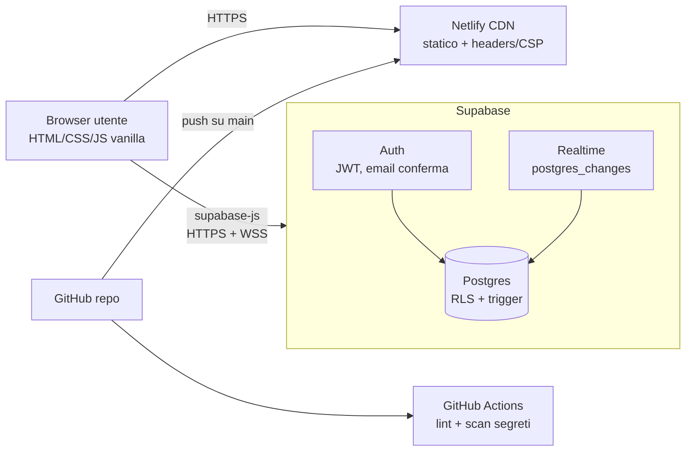

# Architettura

Principi:
- **Niente backend proprio.** Tutta la logica di sicurezza vive nel database (RLS + trigger), il client è non fidato per definizione.
- **Niente build step.** File statici serviti così come sono; l'unica dipendenza runtime è supabase-js da CDN.
- **Il DB è la verità.** Il client non tiene stato autorevole; realtime invalida la vista.

## Schema dati

| Tabella | Scopo | Vincoli chiave |
|---|---|---|
| `profiles` | Nome visibile per utente | PK = `auth.users.id`, auto-creato da trigger alla registrazione |
| `groups` | Comitive | `code` invito unico (6 char), owner |
| `group_members` | Appartenenza | PK (group_id, user_id) |
| `rides` | Auto pubblicate per un giorno | unique (driver, giorno, gruppo); trigger `check_ride` |
| `seat_claims` | Prenotazioni sedile | unique (ride, seat) e (ride, passenger); trigger `check_claim` |
| `ride_requests` | "Cerco un passaggio" | unique (user, giorno, gruppo) |
| `ride_comments` | Thread per auto | check lunghezza 1..300 |

Trigger (fonte: `supabase-setup.sql`):
- `check_ride`: no giorni passati; no auto se sei già passeggero quel giorno.
- `check_claim`: no auto partita/passata; sedile esistente; non sei il guidatore; un solo posto per giorno/gruppo; se guidi quel giorno non prenoti altrove.

## Contratto API (via supabase-js, tutte soggette a RLS)

| Operazione | Chiamata | Autorizzazione |
|---|---|---|
| Registrazione/login/reset | `auth.signUp/signInWithPassword/resetPasswordForEmail` | pubblica (rate-limited) |
| Crea gruppo | `rpc('create_group', {p_name})` → riga `groups` | utente autenticato |
| Entra in gruppo | `rpc('join_group', {p_code})` → riga `groups` | utente autenticato, codice valido |
| Leggi auto del giorno | `from('rides').select(...embed...)` | membro del gruppo o auto pubbliche |
| Pubblica auto | `from('rides').insert` | `driver_id = auth.uid()` + trigger |
| Prenota/lascia sedile | `from('seat_claims').insert/delete` | `passenger_id = auth.uid()` (+ guidatore può liberare) + trigger |
| Richiesta passaggio | `from('ride_requests').insert/delete` | proprie righe |
| Commenti | `from('ride_comments').select/insert/delete` | visibilità = visibilità dell'auto; scrittura propria |

Realtime: canale `posti-live` su `postgres_changes` per `rides`, `seat_claims`, `ride_requests` (RLS applicata anche agli eventi).
