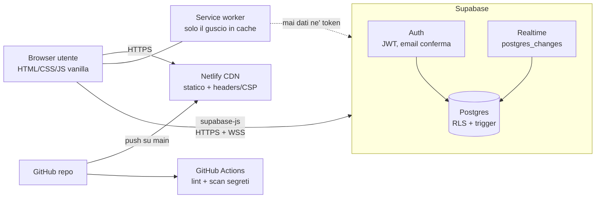

# Architettura

```mermaid
flowchart LR
  U[Browser utente\nHTML/CSS/JS vanilla] -->|HTTPS| N[Netlify CDN\nstatico + headers/CSP]
  U -->|supabase-js\nHTTPS + WSS| S[Supabase]
  U --- SW[Service worker\nsolo il guscio in cache]
  SW -.->|mai dati ne' token| S
  subgraph S[Supabase]
    A[Auth\nJWT, email conferma] --> P[(Postgres\nRLS + trigger)]
    R[Realtime\npostgres_changes] --> P
  end
  G[GitHub repo] -->|push su main| N
  G --> CI[GitHub Actions\nlint + scan segreti]
```

Principi:
- **Niente backend proprio.** Tutta la logica di sicurezza vive nel database (RLS + trigger), il client è non fidato per definizione.
- **Niente build step.** File statici serviti così come sono; l'unica dipendenza runtime è supabase-js da CDN.
- **Il DB è la verità.** Il client non tiene stato autorevole; realtime invalida la vista.
- **Ciò che regge la mancanza di rete non può dipendere dalla rete.** Regola pagata in Fase 4: la
  barra "sei senza rete" e la registrazione del service worker vivevano in `app.js`, che come prima
  riga importa supabase-js **da un CDN**. Senza linea quel modulo non arriva, quindi l'avviso non
  compariva e la PWA non si registrava — proprio a chi ha la rete peggiore. Ora stanno in `rete.js`,
  che non importa niente. Per la stessa ragione `rete.js` **prova** la rete con una richiesta
  piccola invece di fidarsi di `navigator.onLine`, che dice "esiste una scheda di rete", non
  "internet funziona".
- **In cache va il guscio, non i dati.** Il service worker non tocca niente che passi da Supabase,
  né richieste che non siano `GET`: una copia di dati o sessioni sarebbe una copia che
  l'esportazione non mostra e che la cancellazione non porta via.

## I file del frontend

| File | Cosa fa | Perché è separato |
|---|---|---|
| `index.html` | Guscio, sprite delle icone, dati strutturati | — |
| `app.js` | Tutta l'app: auth, gruppi, passaggi, sedili, realtime | Un file solo finché non supera 2-3k righe (ADR 001) |
| `rete.js` | Avviso "sei senza rete" e registrazione del service worker | **Non importa niente**: deve funzionare quando `app.js` non parte |
| `sw.js` | Cache del guscio, apertura offline | Gira in un altro mondo (`self`, nessun DOM) |
| `config.js` | URL e publishable key di Supabase | Pubblici per design |
| `style.css` | Tutto il CSS, con i token in cima | — |
| `offline.html`, `404.html` | Le due pagine che si vedono quando qualcosa non c'è | Servite dal worker e da Netlify |

## Schema dati

| Tabella | Scopo | Vincoli chiave |
|---|---|---|
| `profiles` | Nome visibile per utente | PK = `auth.users.id`, auto-creato da trigger alla registrazione. Da C22 `zona_lat`, `zona_lon`, `zona_nome` e `sospeso_motivo` **non sono leggibili da un client**: la propria riga si prende da `mio_profilo()` |
| `groups` | Comitive | `code` invito unico (6 char), owner |
| `group_members` | Appartenenza | PK (group_id, user_id) |
| `rides` | Auto pubblicate per un giorno | `group_id` obbligatorio; unique (driver, giorno, gruppo, **è-un-ritorno**); trigger `check_ride`. Da C21 le quattro colonne delle coordinate **non sono leggibili da un client**: si passa da `coordinate_passaggi()`. Da C30 `ritardo_min`/`ritardo_alle`, da C31 `ritorno_di` (autoriferimento, `set null`), da C33 `auto_id` |
| `seat_claims` | Prenotazioni sedile | unique (ride, seat) e (ride, passenger); trigger `check_claim`. Da C35 un sedile è **o** di un account **o** di un ospite (`ospite_nome` + `invitato_da`), mai tutti e due e mai nessuno |
| `ride_requests` | "Cerco un passaggio" | `group_id` obbligatorio; unique (user, giorno, gruppo); da C25 di `025` anche `ora` e `nota` |
| `ride_comments` | Thread per auto | check lunghezza 1..300 |
| `ride_waitlist` | Coda quando l'auto è piena | unique (ride, user); promozione automatica alla liberazione di un posto |
| `user_reports` | Segnalazioni verso l'amministratore | motivo fra cinque; una sola aperta per coppia (indice unico parziale) |
| `user_blocks` | "Non ci vediamo più" | PK (blocker, blocked); nessuno può bloccare se stesso |
| `push_subscriptions` | Un'iscrizione push = **un dispositivo**, non una persona | `endpoint` unico; si leggono solo le proprie |
| `notifiche_coda` | Coda degli avvisi da spedire | RLS accesa e **nessuna policy**: la legge solo la Edge Function. Unica per (destinatario, chiave), che è ciò che impedisce il doppione. Cinque tipi da C30 |
| `pagamenti` | I rimborsi avvenuti (il debito si **calcola**) | leggibile **solo dalle due parti**, non dal gruppo né dall'amministratore; la registra una delle due |
| `eventi` | Registro di cosa succede, scritto dai trigger | **nessuna chiave esterna, di proposito**: un registro storico deve sopravvivere a ciò che racconta, e una FK renderebbe impossibile cancellare un account |
| `ricorrenze` | «Ogni lunedì alle 7:40» — la regola, non il passaggio | materializzata da `crea_passaggi_ricorrenti()`, chiamata da `pg_cron` |
| `fermate` | La rubrica dei posti di una comitiva (C32) | `chiave` è **generata dal database** e unica per gruppo: è ciò che rende «Piazza Dante» e «p.za dante» lo stesso posto. Le coordinate **non si raccolgono dalle pubblicazioni**, si mettono con un gesto esplicito |
| `auto` | Il garage di una persona (C33) | leggibile da chi condivide una comitiva (stessa regola dei profili); **una predefinita per persona**, con un indice parziale |

`profiles` porta anche `is_admin` e `sospeso`: nessuno dei due si cambia da soli, ci sono due
trigger apposta. `groups` porta da C36 le tre regole della comitiva (`regola_quota`,
`regola_guida_non_paga`, `regola_max_posti`) e da C38 `scade_il` — le prime tre il database
**non** le fa rispettare, la quarta sì: le regole sono convenzioni fra amici e ammettono
eccezioni, una comitiva chiusa no.

**Aggiungere una colonna a `rides` è un cambiamento a tre posti, non a uno**, e le tre volte in
cui non lo è stato hanno prodotto altrettanti difetti: la tabella, l'archivio `*_archivio_senza_gruppo`
della `010` (che si riempie con `select *`), e una chiamata finale a `blinda_coordinate()` —
senza la quale la colonna nasce **invisibile al client**, perché dalla `016` il permesso su
`rides` è per colonna. Lo verifica `verifica-colonne-leggibili.sql`, che gira fra la prima e la
seconda passata delle migrazioni: dopo la seconda sarebbe sempre verde, ma in produzione si
applica una volta sola.

Trigger (fonte: `supabase/migrations/`):
- `check_ride`: no giorni passati; no auto se sei già passeggero quel giorno; l'auto dichiarata dev'essere tua (C33); la comitiva non dev'essere chiusa, né il giorno oltre la sua fine (C38).
- `check_claim`: no auto partita/passata; sedile esistente; non sei il guidatore; un solo posto per giorno/gruppo; se guidi quel giorno non prenoti altrove.
- `controlla_persone` (sedili, lista d'attesa): non si sale in macchina fra persone bloccate, e un sospeso non prenota. Guarda **la riga** e non `auth.uid()`, perché la promozione dalla lista d'attesa scrive per conto di un altro. Da C35 legge **due** colonne (`passenger_id`, poi `invitato_da`): con un posto da ospite la prima è nulla, e la domanda «è sospeso?» sarebbe diventata una domanda su nessuno.
- `check_ospite` (sedili): chi porta un ospite dev'essere della comitiva, e non ci sono due ospiti con lo stesso nome sulla stessa auto — un nome è tutto ciò che un ospite ha.
- `registra_fermate` (auto pubblicate): mette partenza e destinazione in rubrica. La riempie il database e non il client, o resterebbe vuota per sempre.
- `notifica_posto_prenotato`, `notifica_annullamento`, `notifica_ritardo`: accodano in `notifiche_coda`. Nessuno spedisce niente — spedire vuole una chiave privata e una richiesta HTTP dentro una transazione — e nessuno può far fallire l'operazione che lo ha generato.
- `registra_evento_*`: scrivono in `eventi`. L'attore di un posto è `coalesce(passenger_id, invitato_da)`: un ospite non è una persona di questa applicazione.
- `controlla_sospeso` (gruppi, membri): un sospeso non crea comitive né ci entra. Serve perché `create_group`/`join_group` sono `security definer` e non passano dalle policy.
- `protect_admin_flag`, `protect_sospeso`: nessuno si promuove amministratore né si toglie la sospensione. Fanno eccezione solo le chiamate con `auth.uid()` nullo (SQL editor, `service_role`), che è l'unico modo per nominare il primo amministratore.

## Contratto API (via supabase-js, tutte soggette a RLS)

| Operazione | Chiamata | Autorizzazione |
|---|---|---|
| Registrazione/login/reset | `auth.signUp/signInWithPassword/resetPasswordForEmail` | pubblica (rate-limited) |
| Crea gruppo | `rpc('create_group', {p_name, p_scade})` → riga `groups` | utente autenticato; `p_scade` facoltativo (C38) |
| Entra in gruppo | `rpc('join_group', {p_code})` → riga `groups` | utente autenticato, codice valido e comitiva non chiusa |
| Leggi auto del giorno | `from('rides').select(...embed...)` — colonne nominate, mai `*` | membro del gruppo, più chi vede il passaggio perché è aperto alla zona o a chiunque |
| Punto esatto del ritrovo | `rpc('coordinate_passaggi', {ids})` | solo membro della comitiva che ospita, o chi ha un posto su quell'auto |
| Il proprio profilo, intero | `rpc('mio_profilo')` → una riga di `profiles` | chi chiama, e nessun altro: la funzione non prende parametri |
| Pubblica auto | `from('rides').insert` | `driver_id = auth.uid()` + trigger |
| Prenota/lascia sedile | `from('seat_claims').insert/delete` | `passenger_id = auth.uid()` (+ guidatore può liberare) + trigger |
| Porta un ospite | `from('seat_claims').insert` con `ospite_nome` | `invitato_da = auth.uid()`, e chi invita dev'essere della comitiva. Lo libera anche chi lo ha portato |
| Annuncia un ritardo | `from('rides').update({ritardo_min})` | solo `driver_id = auth.uid()` (policy di `002`) |
| Il saldo con una persona | `rpc('saldo_con', {altro})` | ancorata ad `auth.uid()`: non prende due id, prende **l'altro** |
| Rubrica delle fermate | `from('fermate').select` / `update` del solo punto | membro della comitiva; il **nome** lo scrive il trigger, non il client |
| Il proprio garage | `from('auto').select/insert/update/delete` | le proprie; le leggono anche quelli con cui si condivide una comitiva |
| Regole della comitiva | `from('groups').update({regola_*, scade_il})` | solo chi possiede il gruppo (`groups update owner`, `003`) |
| Richiesta passaggio | `from('ride_requests').insert/delete` | proprie righe |
| Commenti | `from('ride_comments').select/insert/delete` | visibilità = visibilità dell'auto, meno quelli di chi è bloccato; scrittura propria |
| Segnala una persona | `from('user_reports').insert` | `reporter_id = auth.uid()`, non su se stessi, non da sospesi |
| Leggi le segnalazioni | `from('user_reports').select` | chi l'ha scritta, o l'amministratore |
| Blocca / sblocca | `from('user_blocks').insert/delete` | `blocker_id = auth.uid()`; le righe le legge solo chi le ha messe |
| Sospendi / riabilita | `from('profiles').update({sospeso})` | solo amministratore (policy + trigger) |

Realtime: canale `posti-live` su `postgres_changes` per `rides` (insert, delete **e update**:
un ritardo annunciato deve comparire senza ricaricare), `seat_claims`, `ride_requests` e
`ride_waitlist`. La RLS si applica anche agli eventi.
