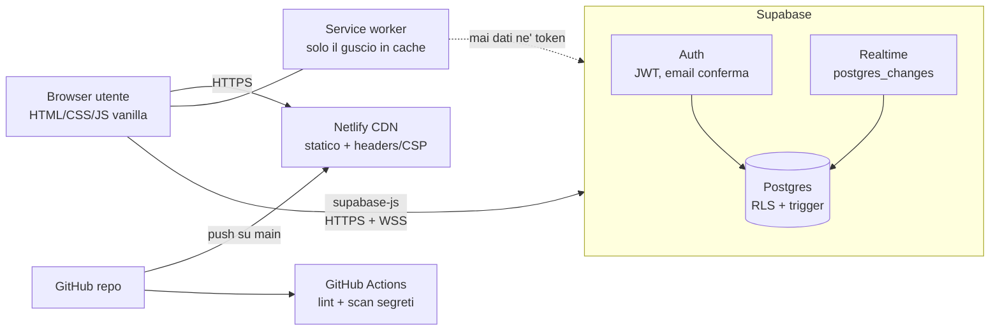

# Architettura

```mermaid
flowchart LR
  U[Browser utente\nHTML/CSS/JS vanilla] -->|HTTPS| N[Netlify CDN\nstatico + headers/CSP]
  U -->|supabase-js\nHTTPS + WSS| S[Supabase]
  U --- SW[Service worker\nsolo il guscio in cache]
  SW -.->|mai dati ne' token| S
  subgraph S[Supabase]
    A[Auth\nJWT, email conferma] --> P[(Postgres\nRLS + trigger)]
    R[Realtime\npostgres_changes] --> P
  end
  G[GitHub repo] -->|push su main| N
  G --> CI[GitHub Actions\nlint + scan segreti]
```

Principi:
- **Niente backend proprio.** Tutta la logica di sicurezza vive nel database (RLS + trigger), il client è non fidato per definizione.
- **Niente build step.** File statici serviti così come sono; l'unica dipendenza runtime è supabase-js da CDN.
- **Il DB è la verità.** Il client non tiene stato autorevole; realtime invalida la vista.
- **Ciò che regge la mancanza di rete non può dipendere dalla rete.** Regola pagata in Fase 4: la
  barra "sei senza rete" e la registrazione del service worker vivevano in `app.js`, che come prima
  riga importa supabase-js **da un CDN**. Senza linea quel modulo non arriva, quindi l'avviso non
  compariva e la PWA non si registrava — proprio a chi ha la rete peggiore. Ora stanno in `rete.js`,
  che non importa niente. Per la stessa ragione `rete.js` **prova** la rete con una richiesta
  piccola invece di fidarsi di `navigator.onLine`, che dice "esiste una scheda di rete", non
  "internet funziona".
- **In cache va il guscio, non i dati.** Il service worker non tocca niente che passi da Supabase,
  né richieste che non siano `GET`: una copia di dati o sessioni sarebbe una copia che
  l'esportazione non mostra e che la cancellazione non porta via.

## I file del frontend

| File | Cosa fa | Perché è separato |
|---|---|---|
| `index.html` | Guscio, sprite delle icone, dati strutturati | — |
| `app.js` | Tutta l'app: auth, gruppi, passaggi, sedili, realtime | Un file solo finché non supera 2-3k righe (ADR 001) |
| `rete.js` | Avviso "sei senza rete" e registrazione del service worker | **Non importa niente**: deve funzionare quando `app.js` non parte |
| `sw.js` | Cache del guscio, apertura offline | Gira in un altro mondo (`self`, nessun DOM) |
| `config.js` | URL e publishable key di Supabase | Pubblici per design |
| `style.css` | Tutto il CSS, con i token in cima | — |
| `offline.html`, `404.html` | Le due pagine che si vedono quando qualcosa non c'è | Servite dal worker e da Netlify |

## Schema dati

| Tabella | Scopo | Vincoli chiave |
|---|---|---|
| `profiles` | Nome visibile per utente | PK = `auth.users.id`, auto-creato da trigger alla registrazione |
| `groups` | Comitive | `code` invito unico (6 char), owner |
| `group_members` | Appartenenza | PK (group_id, user_id) |
| `rides` | Auto pubblicate per un giorno | `group_id` obbligatorio; unique (driver, giorno, gruppo); trigger `check_ride` |
| `seat_claims` | Prenotazioni sedile | unique (ride, seat) e (ride, passenger); trigger `check_claim` |
| `ride_requests` | "Cerco un passaggio" | `group_id` obbligatorio; unique (user, giorno, gruppo) |
| `ride_comments` | Thread per auto | check lunghezza 1..300 |
| `ride_waitlist` | Coda quando l'auto è piena | unique (ride, user); promozione automatica alla liberazione di un posto |
| `user_reports` | Segnalazioni verso l'amministratore | motivo fra cinque; una sola aperta per coppia (indice unico parziale) |
| `user_blocks` | "Non ci vediamo più" | PK (blocker, blocked); nessuno può bloccare se stesso |

`profiles` porta anche `is_admin` e `sospeso`: nessuno dei due si cambia da soli, ci sono due
trigger apposta.

Trigger (fonte: `supabase/migrations/`):
- `check_ride`: no giorni passati; no auto se sei già passeggero quel giorno.
- `check_claim`: no auto partita/passata; sedile esistente; non sei il guidatore; un solo posto per giorno/gruppo; se guidi quel giorno non prenoti altrove.
- `controlla_persone` (sedili, lista d'attesa): non si sale in macchina fra persone bloccate, e un sospeso non prenota. Guarda **la riga** e non `auth.uid()`, perché la promozione dalla lista d'attesa scrive per conto di un altro.
- `controlla_sospeso` (gruppi, membri): un sospeso non crea comitive né ci entra. Serve perché `create_group`/`join_group` sono `security definer` e non passano dalle policy.
- `protect_admin_flag`, `protect_sospeso`: nessuno si promuove amministratore né si toglie la sospensione. Fanno eccezione solo le chiamate con `auth.uid()` nullo (SQL editor, `service_role`), che è l'unico modo per nominare il primo amministratore.

## Contratto API (via supabase-js, tutte soggette a RLS)

| Operazione | Chiamata | Autorizzazione |
|---|---|---|
| Registrazione/login/reset | `auth.signUp/signInWithPassword/resetPasswordForEmail` | pubblica (rate-limited) |
| Crea gruppo | `rpc('create_group', {p_name})` → riga `groups` | utente autenticato |
| Entra in gruppo | `rpc('join_group', {p_code})` → riga `groups` | utente autenticato, codice valido |
| Leggi auto del giorno | `from('rides').select(...embed...)` | membro del gruppo (unica strada: non esistono auto senza gruppo) |
| Pubblica auto | `from('rides').insert` | `driver_id = auth.uid()` + trigger |
| Prenota/lascia sedile | `from('seat_claims').insert/delete` | `passenger_id = auth.uid()` (+ guidatore può liberare) + trigger |
| Richiesta passaggio | `from('ride_requests').insert/delete` | proprie righe |
| Commenti | `from('ride_comments').select/insert/delete` | visibilità = visibilità dell'auto, meno quelli di chi è bloccato; scrittura propria |
| Segnala una persona | `from('user_reports').insert` | `reporter_id = auth.uid()`, non su se stessi, non da sospesi |
| Leggi le segnalazioni | `from('user_reports').select` | chi l'ha scritta, o l'amministratore |
| Blocca / sblocca | `from('user_blocks').insert/delete` | `blocker_id = auth.uid()`; le righe le legge solo chi le ha messe |
| Sospendi / riabilita | `from('profiles').update({sospeso})` | solo amministratore (policy + trigger) |

Realtime: canale `posti-live` su `postgres_changes` per `rides`, `seat_claims`, `ride_requests` (RLS applicata anche agli eventi).
